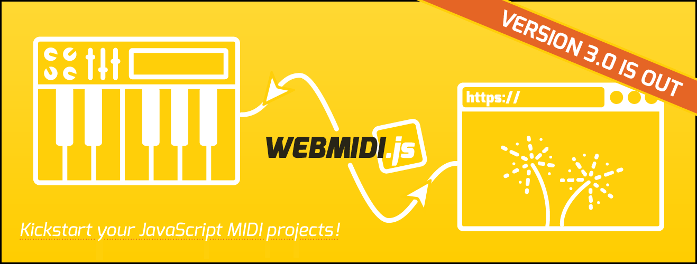

After a lot of work and testing, I am happy to announce today that version 3 of the go-to MIDI
library for JavaScript has been released! You can [try it out](https://webmidijs.org/docs) right 
now!

<!--truncate-->

### About WEBMIDI.js

[**WEBMIDI.js**](https://webmidijs.org) exists to make it easier for developers to use the
[Web MIDI API](https://webaudio.github.io/web-midi-api/). The Web MIDI API is a really exciting
addition to the web platform allowing a web page to interact directly with MIDI musical instruments
and devices.

While great, many developers will find the API to be too low-level for their needs. Having to
perform binary arithmetic or needing to constantly refer to the 300-page MIDI spec is no fun (trust
me on this!). So, the goal for [**WEBMIDI.js**](https://webmidijs.org) is to get developers and 
musicians started with their web-based MIDI projects as efficiently as possible.

As of today, [**WEBMIDI.js**](https://webmidijs.org) generates over **744K hits a month on
[jsDelivr](https://www.jsdelivr.com/package/npm/webmidi)**. It is **downloaded over 4.4K times a
month on [NPM](https://www.npmjs.com/package/webmidi)** and has been **starred by over
[1000 developers](https://github.com/djipco/webmidi/stargazers)** on GitHub. Not too bad for a niche
library that grew out of a personal passion project. 😀

### About the New Version 3

Version 3 has been rewritten from scratch to make it both future-proof and backwards-compatible. It 
uses a modern development paradigm and now has its own dedicated website at 
[**webmidijs.org**](https://webmidijs.org). The library offers numerous new features such as:

* Long-awaited **support for Node.js** (thanks to the [jzz](https://www.npmjs.com/package/jzz)
  module by Jazz-Soft). The exact same code can be used in supported browsers and in Node.js.

* Distribution in **3 flavours**: **ESM** (ECMAScript module for modern browsers), **CJS** (CommonJS
  module for Node.js) and **IIFE** (Immediately Invoked Function Expression for legacy browsers and
  _ad hoc_ usage).

* **TypeScript Support**. Every new release includes a TypeScript definition file for CJS and ESM in
the `dist` directory.

* **New `InputChannel` and `OutputChannel`** objects. You can now work with a single MIDI channel if 
that's appropriate for your needs.

* **New `Note` object**. Makes it easier to work with notes and pass them around from one method to 
the next.

* **New `Message` object** that allows easier routing of MIDI messages, including the ability to 
automatically **forward inbound MIDI messages** to one, or more, outputs (much like the good ol' 
physical THRU port).

* Improved support for **system exclusive** (sysex) messages.

* **Support for promises** while preserving legacy callback support.

* Improved **support for RPN/NRPN messages**.

* Addition of **hundreds of unit tests** to make sure the library remains stable at all times.

* and lots more...

### Try it out!

The [documentation section](https://webmidijs.org/docs) of the new website has all the information 
to get you started. If you need help, you can exchange with fellow users and myself using the 
[GitHub Discussions](https://github.com/djipco/webmidi/discussions) platform.

If you use the library and find it useful, please think about 
[sponsoring](https://github.com/sponsors/djipco) 💜 the project.

Cheers!

Jean-Philippe

